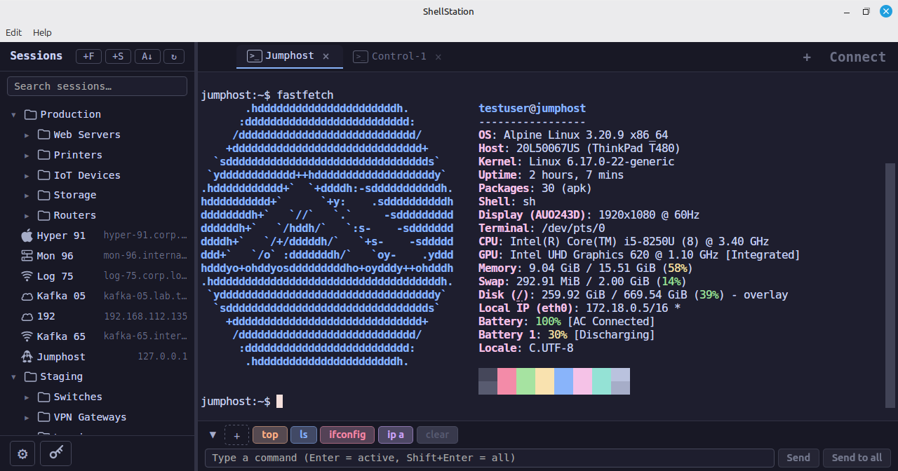

# ShellStation

**Cross-platform terminal manager and SSH/Telnet client for network engineers and sysadmins.**

ShellStation replaces tools like mRemoteNG and SecureCRT with a modern, open-source alternative that runs on Linux, macOS, and Windows.



## Why ShellStation?

| Problem | ShellStation |
| ------- | ------------ |
| mRemoteNG is Windows-only | Runs on Linux, macOS, Windows |
| XML session storage degrades at scale | SQLite (local) or PostgreSQL (team) backend |
| PuTTY dependency for SSH | Built-in SSH2 and Telnet — no external tools |
| Jump host setup is cumbersome | First-class ProxyJump chaining with arbitrary hop depth |
| SecureCRT costs $100+/seat | Free and open source |
| No multi-user session sharing | PostgreSQL mode with row-level security for teams |

## Features

- **Built-in terminal emulator** — xterm.js with WebGL rendering, themes, search, ligatures
- **SSH2 and Telnet** — password, public key, keyboard-interactive authentication
- **Jump host chaining** — connect through multiple bastions (A -> B -> C -> target)
- **Session management** — folders, tags, search, drag-and-drop, bulk editing
- **Command broadcast** — send commands to multiple sessions simultaneously
- **Import** — migrate from mRemoteNG XML, SecureCRT XML, or CSV
- **Credential manager** — secrets stored in the OS keychain (Keychain, Secret Service, Credential Manager)
- **Multi-user mode** — shared PostgreSQL database with per-user visibility and credential isolation
- **Keyword highlighting** — import SecureCRT highlight profiles or create your own
- **Session logging** — automatic plain-text logs with ANSI stripping

## Installation

Download the latest release for your platform from the [Releases](../releases) page:

- **Linux**: `.deb` or `.AppImage`
- **macOS**: `.dmg`
- **Windows**: `.msi`

### Building from Source

Prerequisites: [Rust](https://rustup.rs/), [Node.js](https://nodejs.org/) (v18+), and the [Tauri prerequisites](https://v2.tauri.app/start/prerequisites/) for your OS.

```bash
git clone https://github.com/LuminaApps/shellstation.git
cd shellstation
npm install
npm run tauri build
```

The built application will be in `src-tauri/target/release/bundle/`.

## Tech Stack

| Layer | Technology |
| ----- | ---------- |
| App shell | [Tauri 2](https://v2.tauri.app/) (native webview, small binaries) |
| Backend | Rust (async via Tokio) |
| Frontend | React + TypeScript |
| Terminal | [xterm.js](https://xtermjs.org/) |
| SSH | [russh](https://github.com/warp-tech/russh) (pure Rust SSH2) |
| Database | SQLite (single-user) / PostgreSQL (teams) via [sqlx](https://github.com/launchbadge/sqlx) |

## Configuration

ShellStation stores its configuration in the platform config directory:

- **Linux**: `~/.config/shellstation/`
- **macOS**: `~/Library/Application Support/shellstation/`
- **Windows**: `%APPDATA%\shellstation\`

### PostgreSQL Multi-User Setup

For team deployments with shared session databases, see the [PostgreSQL Administration Guide](DESIGN.md#46-postgresql-administration-guide) in the design document.

## Development

```bash
# Start the dev server with hot reload
npm run tauri dev

# Lint (must pass before committing)
cd src-tauri && cargo clippy -- -D warnings
cd src-tauri && cargo fmt -- --check
npx eslint .
npx prettier --check "src/**/*.{ts,tsx,css,json}"
npx tsc --noEmit
```

See [DESIGN.md](DESIGN.md) for architecture details, database schema, and the development roadmap.

## Contributing

Contributions are welcome. Please ensure all linters pass with zero warnings before submitting a pull request.

## License

This project is licensed under the [GNU General Public License v3.0](LICENSE).
